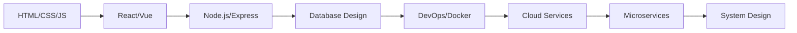

# 👋 Hello, I'm Ari Eka Prianda

<div align="center">

</div>

<div align="center">

</div>

<p align="center">
<b>✨ Crafting Digital Experiences | Transforming Ideas into Reality ✨</b>
</p>

---

## 🚀 About Me

I'm a passionate **Full Stack & Mobile Developer** from Indonesia 🇮🇩, dedicated to building innovative solutions that make a difference. I love turning complex problems into simple, beautiful, and intuitive designs.

```javascript
const ari = {
    location: "Bogor, Indonesia 🌏",
    currentFocus: "Building scalable web & mobile applications",
    interests: ["Clean Code", "UI/UX Design", "Open Source", "AI/ML"],
    funFact: "I debug with console.log and I'm not ashamed! 😄",
    lifePhilosophy: "Code with passion, debug with patience"
};
```

---

## 💻 Tech Stack

<div align="center">

### Frontend


### Backend


### Mobile Development


### Database


### Tools & Others


</div>

---

## 📊 GitHub Stats

<div align="center">
  


</div>

---

## 🏆 Featured Projects

<div align="center">

### 🎯 Recent Work

</div>

| Project | Description | Tech Stack | Link |
|---------|-------------|------------|------|
| **🚀 E-Commerce Platform** | Full-featured online shopping platform with payment integration | React, Node.js, MongoDB, Stripe | [View](https://github.com/ariekaprianda) |
| **📱 TaskMaster Mobile** | Cross-platform productivity app with cloud sync | React Native, Firebase, Redux | [View](https://github.com/ariekaprianda) |
| **🎨 Portfolio CMS** | Custom content management system for creatives | Laravel, Vue.js, MySQL | [View](https://github.com/ariekaprianda) |
| **🤖 AI Chatbot** | Intelligent customer service bot with NLP | Python, TensorFlow, Flask | [View](https://github.com/ariekaprianda) |

---

## 📈 Contribution Activity

<div align="center">


</div>

---

## 💡 What I'm Currently Working On

- 🔨 Building a **SaaS platform** for small businesses
- 📚 Learning **TypeScript** and **Next.js** for better web apps
- 🤝 Contributing to **open-source projects**
- 📱 Developing a **mobile fitness tracking app**
- 🌱 Exploring **AI/ML integration** in web applications

---

## 🎯 2024 Goals

- ✅ Master advanced React patterns
- ✅ Contribute to 10+ open source projects
- ✅ Build and launch 3 mobile apps
- ✅ Learn cloud architecture (AWS/GCP)
- ✅ Share knowledge through technical blogging

---

## 📝 Latest Blog Posts

<!-- BLOG-POST-LIST:START -->
- 🔥 Building Scalable APIs with Node.js Best Practices
- 💡 React Performance Optimization Techniques
- 🎨 Modern CSS: From Flexbox to Grid
- 🚀 Deploying Full Stack Apps to Production
<!-- BLOG-POST-LIST:END -->

---

## 💬 Let's Talk About...

```typescript
const interests = {
    code: ['Clean Architecture', 'Design Patterns', 'Testing'],
    design: ['Minimalism', 'User Experience', 'Accessibility'],
    tools: ['VS Code Extensions', 'Productivity Hacks', 'Git Workflows'],
    random: ['Coffee ☕', 'Tech Podcasts 🎧', 'Sci-Fi Movies 🎬']
};
```

---

## 🤝 Open for Collaboration!

I'm always excited to work on:
- 🚀 Innovative web/mobile applications
- 🌍 Open source projects
- 💡 Startup ideas and MVPs
- 📚 Educational content and tutorials
- 🎨 UI/UX design projects

**Feel free to reach out if you want to build something amazing together!**

---

## 📫 How to Reach Me

<div align="center">

[](https://www.linkedin.com/in/ari-eka-prianda-78714232a)
[](https://www.instagram.com/ARIEKAPRIANDA47)
[](https://github.com/ariekaprianda)
[](mailto:your.email@example.com)
[](https://yourportfolio.com)
[](https://twitter.com/yourusername)

</div>

---

## 🏅 Achievements & Certifications

<div align="center">

| Certification | Provider | Year |
|---------------|----------|------|
| 🎓 **Full Stack Web Development** | FreeCodeCamp | 2023 |
| 🎓 **React - The Complete Guide** | Udemy | 2023 |
| 🎓 **AWS Certified Developer** | Amazon Web Services | 2024 |
| 🎓 **Google Mobile Web Specialist** | Google | 2024 |

</div>

---

## 💼 Work Experience

```yaml
current:
  position: "Full Stack Developer"
  company: "Tech Startup"
  duration: "2023 - Present"
  responsibilities:
    - Leading frontend architecture decisions
    - Developing scalable REST APIs
    - Mentoring junior developers

previous:
  - position: "Mobile Developer"
    company: "Digital Agency"
    duration: "2021 - 2023"
  
  - position: "Junior Web Developer"
    company: "Software House"
    duration: "2020 - 2021"
```

---

## 🎨 Design Philosophy

> "Good design is obvious. Great design is transparent." - Joe Sparano

I believe in:
- 🎯 **User-First Approach** - Always prioritize user experience
- 🧩 **Modular Code** - Write reusable and maintainable components
- ⚡ **Performance** - Optimize for speed and efficiency
- 🔒 **Security** - Never compromise on data protection
- 📱 **Responsive** - Design for all devices and screen sizes

---

## 📚 Learning Path

<div align="center">



</div>

---

## 🎮 GitHub Trophies

<div align="center">


</div>

---

## 📌 Pinned Repositories

<div align="center">

[](https://github.com/ariekaprianda/repo-name-1)
[](https://github.com/ariekaprianda/repo-name-2)

</div>

---

## 💖 Support My Work

If you like my work and want to support me:

<div align="center">

[](https://www.buymeacoffee.com/yourusername)
[](https://www.paypal.me/yourusername)

</div>

---

## 🎵 Spotify Playing

<div align="center">

[](https://open.spotify.com/user/yourusername)

</div>

---

## 📊 Weekly Development Breakdown

```text
TypeScript   12 hrs 30 mins  ████████████░░░░░░░░░   48.2%
JavaScript   6 hrs 15 mins   ██████░░░░░░░░░░░░░░░   24.1%
React        4 hrs 20 mins   ████░░░░░░░░░░░░░░░░░   16.7%
CSS          2 hrs 10 mins   ██░░░░░░░░░░░░░░░░░░░    8.4%
Other        40 mins         █░░░░░░░░░░░░░░░░░░░░    2.6%
```

---

## 🌟 Random Dev Quote

<div align="center">


</div>

---

## 🐍 Contribution Snake

<div align="center">


</div>

---

<div align="center">

### 💖 Thanks for visiting!


**"The only way to do great work is to love what you do." - Steve Jobs**

### Show some ❤️ by starring some of the repositories!

</div>

---

<div align="center">

### 📝 Latest Activity

<!--START_SECTION:activity-->
<!--END_SECTION:activity-->

</div>

---

<div align="center">

⭐️ From [Ari Eka Prianda](https://github.com/ariekaprianda) with 💙

**Let's connect and build something incredible together!** 🚀

</div>
